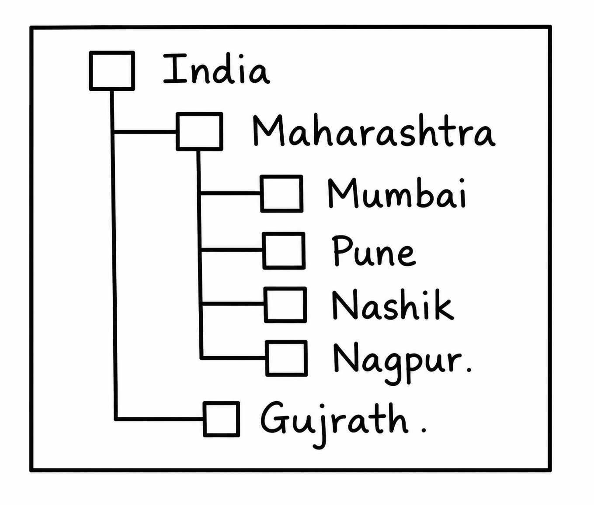

# Experiment No-02

## Aim: 
- Develop a program to demonstrate a progressbar showing progress value in percentage by using set values.

## Objective: 
- To write the programs using Advanced Swing Components
- To demonstrate the use of different advanced swing components.

## Theory:
### Advanced Swing Components:

**JTable**
A table is a component of the swing class that displays rows and columns of data. Tables are implemented by using the JTable class.

**JProgressBar**
The JProgressBar class is used to display the progress of the task. It inherits JComponent class.

**JTree**
The JTree class is used to display the tree structured data or hierarchical data. JTree is a complex component. It has a 'root node' at the top most which is a parent for all nodes in the tree. It inherits JComponent class.

**JTabbedPane**
The JTabbedPane class is used to switch between a group of components by clicking on a tab with a given title or icon. It inherits JComponent class.

**JSlider**
The Java JSlider class is used to create the slider. By using JSlider, a user can select a value from a specific range.

**JDialog**
The JDialog control represents a top level window with a border and a title used to take some form of input from the user. It inherits the Dialog class.
Unlike JFrame, it doesn't have maximize and minimize buttons.

**JToolTip**
The JToolTip class in Java Swing is used to display a small "tip" or descriptive text when the cursor hovers over a component. It is a subclass of the JComponent class.

**JScrollPane**
A JscrollPane is used to make scrollable view of a component. When screen size is limited, we use a scroll pane to display a large component or a component whose size can change dynamically.

## Conclusion:
- In this experiment, we have learnt different advanced swing controls and its demonstration in various applications.

## Exercise:
1)	Build a program to generate following output.

2)	Construct a program to generate the following output. (Using JTable)

| ID  | Name    | Salary |
|-----|---------|--------:|
| 101 | Sanchit | 500000 |
| 102 | Ram     | 600000 |
| 103 | Ajay    | 700000 |

3) Develop a program to demonstrate the use of ScrollPane in Swings
4) Develop a program to demonstrate a progressbar showing progress value in percentage by  using set values.
5) Create a program to demonstrate grid of 5 by 5.
6) Build a program to demonstrate border layout.
