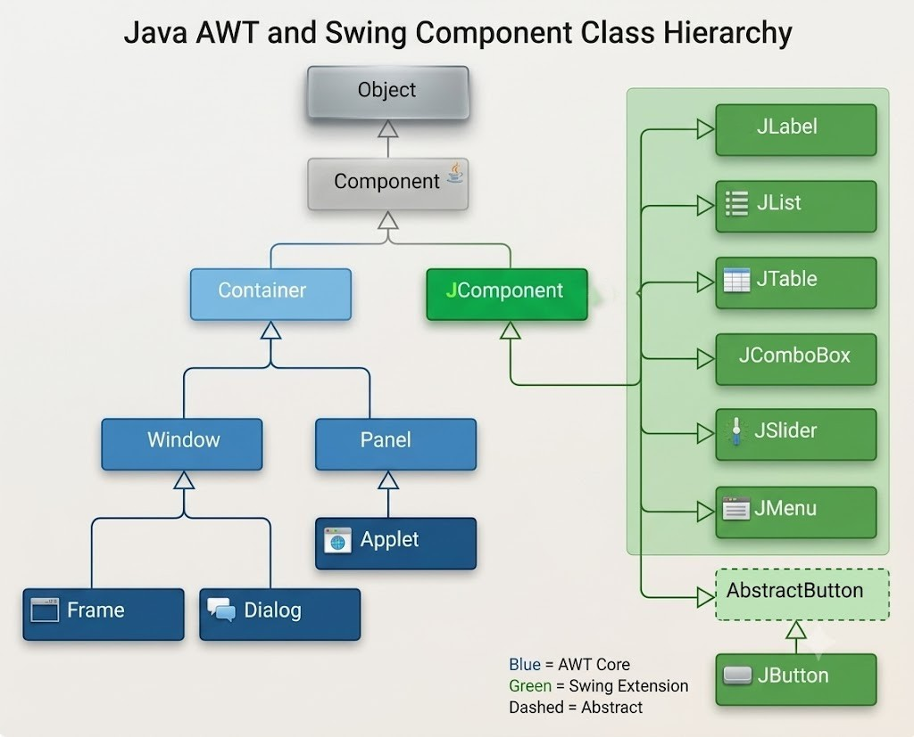

# Unit 01 — Part 2

## Swing Classes Hierarchy



## Commonly Used Methods of Component Class
> The `Component` class (`java.awt.Component` ot `javax.swing.JComponent`) is the superclass for all GUI elements in Java, including both AWT and Swing components. It defines a set of common methods that control the **size, position, layout, visibility, and behavior** of GUI components. Since `Container` and `JComponent` extend `Component`, all Swing components inherit these methods.

Some of the most commonly used methods are: **`add()`, `setSize()`, `setLayout()`, and `setVisible()`**.

---

## 1. `add()` Method

- Belongs to the **`Container`** class (used to add a component to a container).
- It is used to **add a GUI component** (such as a `JButton`, `JLabel`, or `JTextField`) to a container like `JFrame`, `JPanel`, or `JDialog`.

**Syntax:**
```java
Component add(Component c)
```

**Example:**
```java
import javax.swing.*; // or import javax.JFrame; and import javax.JButton;
// You have to import the `JFrame` class and `JButton` class

JFrame frame = new JFrame();
JButton button = new JButton("Click Me");
frame.add(button);   // adds the button to the frame
```

**Overloaded Forms:**
```java
add(Component c)                     // adds component
add(Component c, int index)          // adds component at a specific position
add(Component c, Object constraints) // adds component with layout constraints (e.g., BorderLayout.NORTH)
```

---

## 2. `setSize()` Method

- Belongs to the **`Component`** class.
- Used to set the **width and height** of a component (usually a top-level container like `JFrame`).

**Syntax:**
```java
void setSize(int width, int height)
```

**Example:**
```java
import javax.swing.JFrame; // or import javax.swing.*;
// Because you have to import the `JFrame` class

JFrame frame = new JFrame();
frame.setSize(400, 300);   // width = 400px, height = 300px
```
**Note:**
>  If `setSize()` is not called, the frame's default size is `0x0`, and nothing will be visible.

---

## 3. `setLayout()` Method

- Belongs to the **`Container`** class.
- Used to set the **layout manager** for a container, which decides how components are arranged (positioned and sized) within it.

**Syntax:**
```java
void setLayout(LayoutManager mgr)
```

**Example:**
```java
import javax.swing.JFrame; // or import javax.swing.*;
import java.awt.FlowLayout; // or import java.awt.*;
JFrame frame = new JFrame();
frame.setLayout(new FlowLayout());   // components arranged left to right
```

Common layout managers: `FlowLayout`, `BorderLayout`, `GridLayout`, `CardLayout`, `BoxLayout`, `GridBagLayout`.

> **Note:** If `setLayout(null)` is used, it means **no layout manager** — components must be positioned manually using `setBounds()`.

---

## 4. `setVisible()` Method

- Belongs to the **`Component`** class.
- Used to make a component **visible or invisible** on the screen.
- By default, a `JFrame` (and most components) is **invisible** (`false`) until explicitly set to `true`.

**Syntax:**
```java
void setVisible(boolean b)
```

**Example:**
```java
import javax.swing.JFrame;

JFrame frame = new JFrame();
frame.setVisible(true);   // makes the frame visible
```

> **Best Practice:** `setVisible(true)` should always be called **last**, after adding all components and setting size/layout — otherwise components may not render properly.

---

## Complete Example Using All Four Methods

```java
import javax.swing.*; // for JFrame, JButton
import java.awt.*; // for FlowLayout

public class SimpleFrame {
    public static void main(String[] args) {
        JFrame frame = new JFrame("My First Swing Frame");   // create frame
        JButton button = new JButton("Click Me");            // create button

        frame.setLayout(new FlowLayout());   // set layout manager
        frame.add(button);                   // add button to frame
        frame.setSize(400, 300);             // set frame size
        frame.setVisible(true);              // make frame visible
    }
}
```

::: tip Remember

- `add()` → adds a component to a container.
- `setSize(width, height)` → sets the width and height of a component/container.
- `setLayout(LayoutManager)` → assigns a layout manager to arrange child components.
- `setVisible(true/false)` → controls whether the component is shown on screen; **must be called after** adding components, for correct rendering.
- All these methods are inherited from the **`Component`** (and `Container`) class, so they work on both AWT and Swing components.

:::